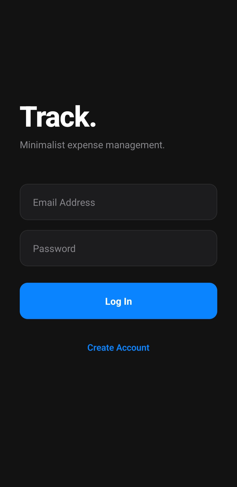
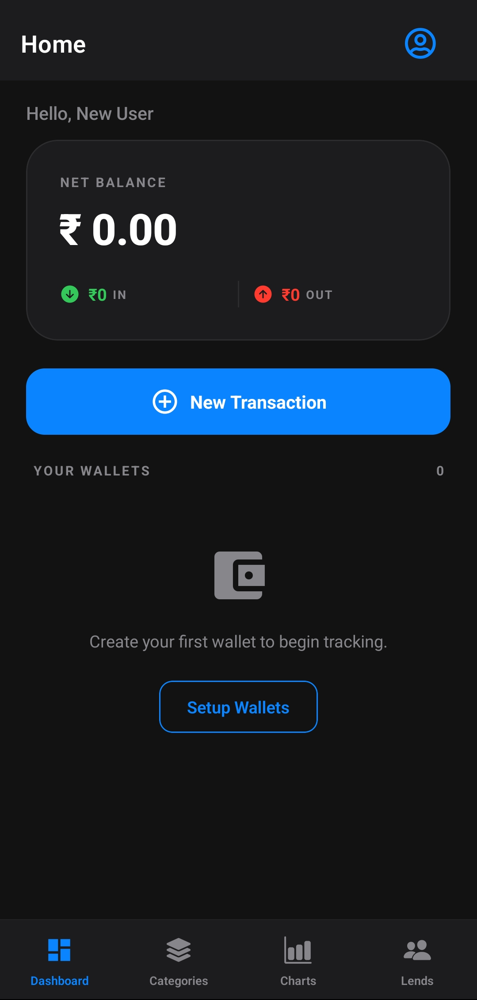
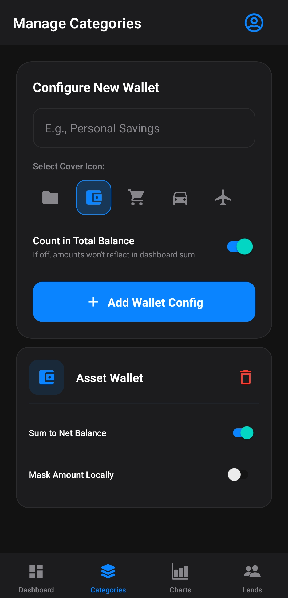
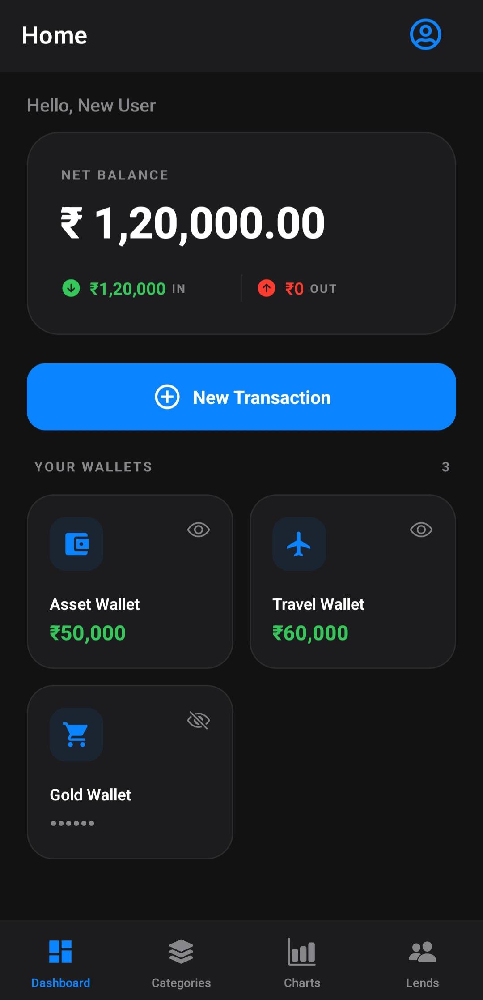
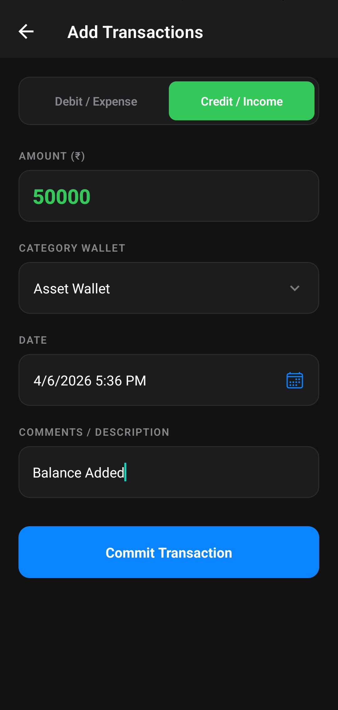
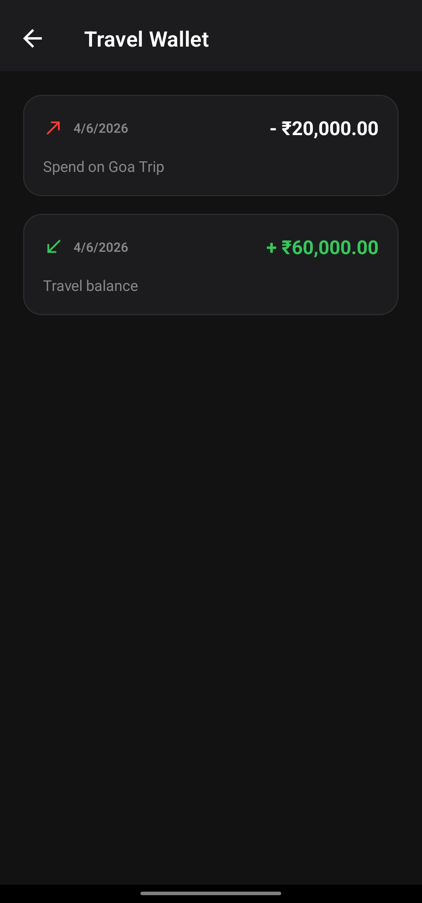
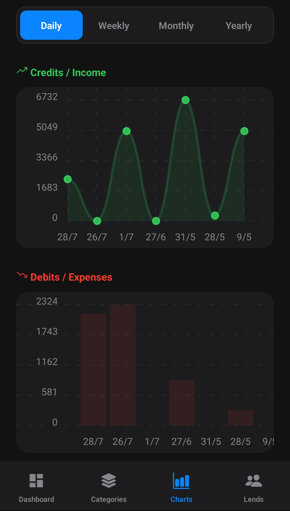
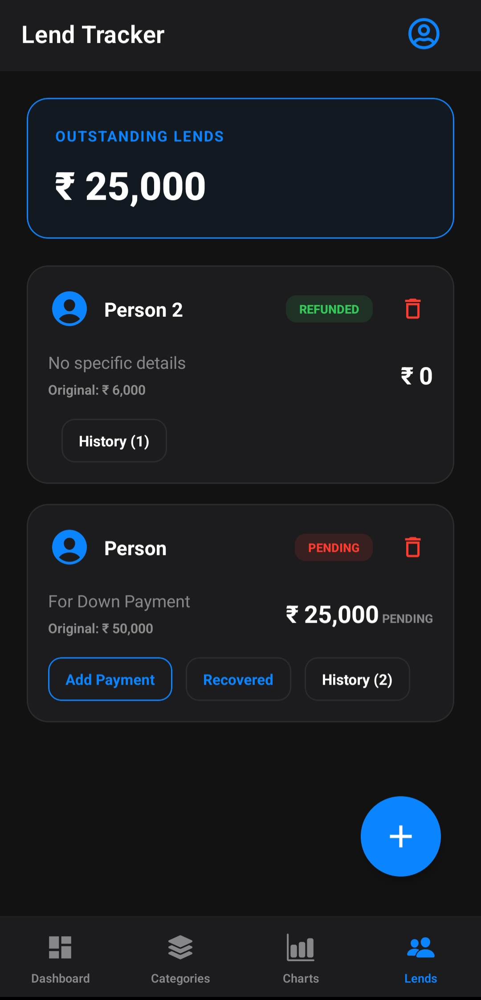
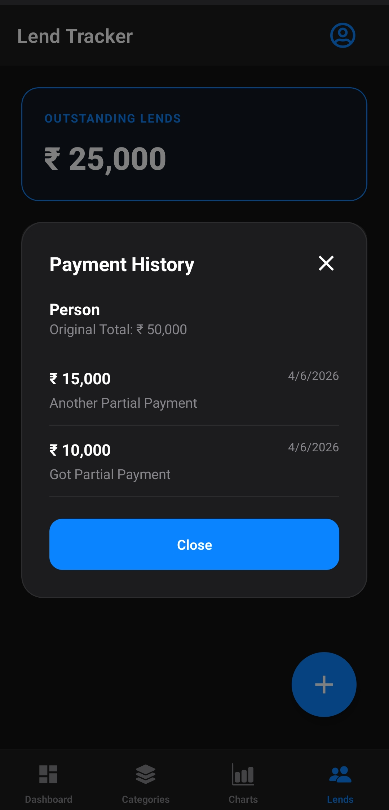

# ExpenseTracker - Smart Finance Manager

Take control of your finances with **ExpenseTracker**, the most intuitive and powerful expense management tool designed for the modern user. Whether you're tracking daily coffee runs or managing complex lending records, ExpenseTracker keeps your data organized, secure, and accessible.

## 🚀 Key Features

### 📊 Real-Time Dashboard
Get an instant overview of your financial health. See your total balance, recent activities, and individual wallet statuses at a single glance.

### 💸 Infinite Transaction History
Browse through thousands of records without a lag. Our optimized **Batch Loading** technology ensures your history is always snappy, sorted by most recent first, and easily filterable by category.

### 🤝 Advanced Lend Tracker (New!)
Never forget a debt again. Our specialized Lend Tracking system allows you to:
- **Record Lends**: Track who owes you what.
- **Partial Recovery**: Accept payments in chunks and keep a running balance.
- **Payment History**: Every partial payment includes a timestamp and your personalized comment.
- **Automatic Fulfillment**: The app automatically marks records as "Recovered" once the full amount is reached.

### 🎨 Premium Dark & Light Modes
Whether you prefer the sleek "Cyber-Kolkata" dark theme or a clean obsidian-style light mode, ExpenseTracker adapts to your style and reduces eye strain.

### 📁 Smart Category Wallets
Organize your money into virtual wallets. Each category maintains its own balance, automatically adjusting as you add or edit transactions.

### 📈 Visual Analytics
Understand your spending patterns with beautiful, interactive charts. See where your money goes and make informed decisions to save more.

---

## 📱 App Screenshots

### 🟢 Dashboard & Home

*High-level overview of your wealth and recent activities.*

---

### 💳 Transaction Management

  
  
  

*Effortless tracking, editing, and filtering of your financial records.*

---

### 🤝 Advanced Lending Tracker

  
  

*Track partial recoveries, payment history, and pending balances in detail.*

---

### 📈 Analysis & Insights

  
  
  

*Visual spending breakdowns and interactive charts.*

---

## 🔒 Secure & Synced
Powered by Firebase, your data is always backed up and synced across your devices. Never worry about losing your financial records again.

---

### **About the Developer**
Built with ❤️ for users who value simplicity and power in their financial tools.
